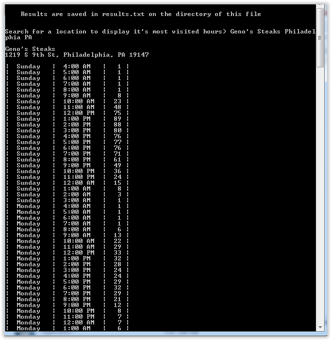

#Get the Popular Times for Businesses from Google Maps

I've done a freelance job in December 2016 on Upwork, and I was a new Python Developer after working with PHP for 10 years, and Java for 3 years before that. My first Python project ever was to get the comments of a Disqus comments section and put all the comments in my Kindle.

But I was already doing paid Python projects after that, having fell in love with Python's language structure and especially it's interactive console that was lacking when I was using PHP. It opened my eyes for the possibilities for software engineering. Got $100 here.

I need to extract some data from a Google Maps location information page that is not available via either the Google Maps or Google Places API.

> See the following URL for example: https://www.google.com/maps/place/Khyber+Pass+Pub/@39.9486464,-75.146326,17z/data=!4m12!1m6!3m5!1s0x89c6c8857234d3e9:0xb5ec0b7cfcbf4cce!2sKhyber+Pass+Pub!8m2!3d39.9486423!4d-75.1441373!3m4!1s0x89c6c8857234d3e9:0xb5ec0b7cfcbf4cce!8m2!3d39.9486423!4d-75.1441373 The information panel shows a "Popular Times" section. We need to extract the popular times data for a specified location for all days and times. We need to do this via a script and not done by data entry as we will be turning this into a web based script to extract and store the data in a database.

I happily jumped at the chance and got this review

> Mark did an incredible job on a very tough task. He wrote a fully commented Python script that gave us everything we asked for, and did it very quickly. We will definitely look for projects in the future that can use his skillset.

You could see the results of what this Python program could do below. Just write in a business and it will return it's most popular active times by each day, which is what this client wanted. Luckily, in December 2019 it still hasn't broken yet!

